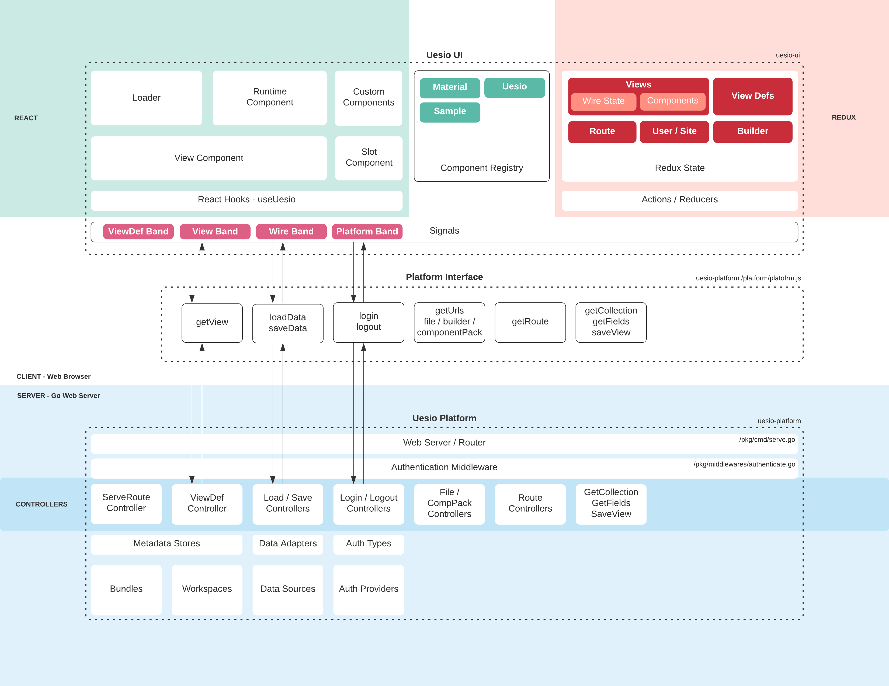
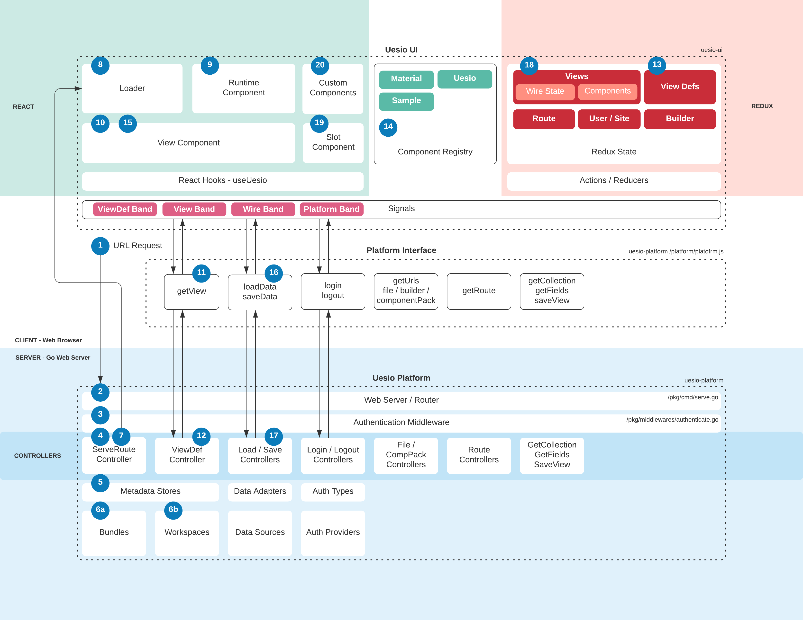

# Uesio Architecture and Documentation

## Changing non root readme file

Architecture Docs and Diagrams for Uesio

## Architecture Diagram

## Loading Process Flow

1. The user requests a URL.
2. Webserver receives request, routes through middleware and then on to the appropriate controller.
3. Authentication middleware determines the appropriate site and session from the domain and cookie. It attaches site and session to the request context.
4. ServeRoute controller checks in the metadata store to determine which route is the appropriate route to return to the user.
5. Metadata store determines whether bundle metadata or workspace metadata is appropriate.
6. a) If there is no workspace context, then metadata will be retrieved from a bundle. The appropriate bundle version can be determined by looking up the installed bundles for that site. b) If there is a workspace context, the metadata is retrieved from the appropriate workspace.
7. ServeRoute controller responds with an html file (platform/index.gohtml) and merges in the default load state. This typically includes route, site, and user information.
8. Loader attaches React to the DOM using ReactDOM.render(), and initializes the Runtime component.
9. Runtime component initializes the Redux store, initializes the ThemeProvider, and loads buildtime dependencies if necessary. It then loads the view component for the appropriate view name.
10. View component checks for its view definition in the Redux store. If it does not exist, it calls the getView() platform function.
11. getView() platform function makes a XHR to the plaform server to request the view definition.
12. The request is routed to the ViewDef Controller and the definition is retrieved from the metadata store. (See steps 5 and 6.) The definition is returned as the XHR response.
13. The view definition is added to the Redux store and a re-render of the view component is triggered.
14. Since the view definition is now available, the dependencies for the view are inspected and all component pack dependencies are loaded and their component definitions are placed into the component registry.
15. The wires section of the view definition is used to create a load request for the wires.
16. loadData() platform function makes a XHR to the platform server to request data and metadata from the wires.
17. The request is routed to the Load Controller and the load is performed using the appropriate data source credentials and data adapter.
18. Wire load data and metadata is placed into the Redux store and a re-render of the view component is triggered.
19. This time, the view component has all of the information it needs to load the components specified in the components section of the view definition. The components list are sent to the slot component and the components are rendered.
