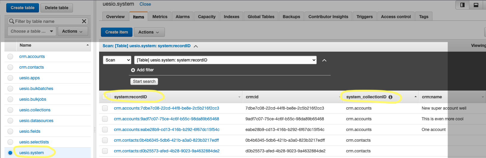
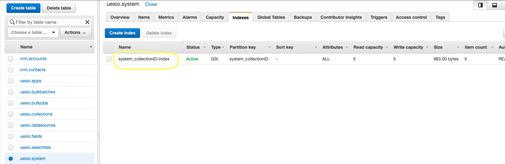

# Uesio Data Adapters Documentation

In this document we describe specific requirements of the Uesio data adapters.

## Firestore

To be implemented

## DynamoDB (Multiple tables)

Just setting the basic credentials and execute the uesio migrate command should be enough to start this data adapter.

## DynamoDB (Single table)

In order to work, this adapter needs a basic configuration on DynamoDB service. In addition to the login credentials, some environment variables must be configured.

> export DYDB_TABLE_NAME="uesio.system"

This contains the name of the table that stores all the Uesio records.

> export DYDB_TABLE_GSI_NAME="system_collectionID-index"

This contains the name of the global secondary index (GSI) for example:

> export DYDB_RECORD_ID_NAME="system:recordID"

This contains the name of the field used as global id for each one of the records.

> export DYDB_RECORD_COLLECTION_ID_NAME="system_collectionID"

This contains the name of the field used as GSI, that in our case specifies the collection id for each one of the records.

## Postgresql

To be implemented
